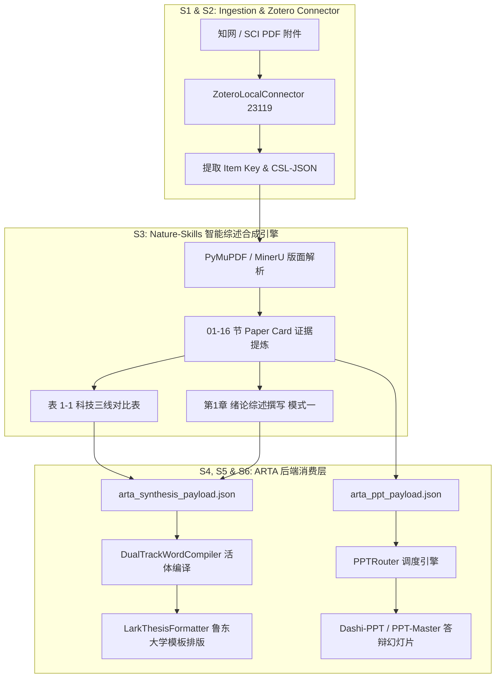

# ARTA (Academic-Review-Thesis-Agent) 协同架构与 Zotero 综述生成全流程指南

> 本指南针对用户现有的 **ARTA (Academic-Review-Thesis-Agent)** 智能体架构、Zotero 本地活体 23119 通信层、`DualTrackWordCompiler` 双轨 Word 编译层、`LarkThesisFormatter` 高校毕业论文排版层及 `PPTRouter` 演示文稿调度层进行深度适配与无缝组装。

---

## 目录

- [一、 ARTA 现有架构与本方案的适配性评估](#一-arta-现有架构与本方案的适配性评估)
- [二、 核心数据契约与接口无缝映射 (Data Contracts)](#二-核心数据契约与接口无缝映射-data-contracts)
- [三、 全流程分层执行架构](#三-全流程分层执行架构)
- [四、 独立测试与交付产物验证](#四-独立测试与交付产物验证)
- [五、 分步组装与一键运行指南](#五-分步组装与一键运行指南)
- [六、 分支同步与本地 Git 代码拉取](#六-分支同步与本地-git-代码拉取)

---

## 一、 ARTA 现有架构与本方案的适配性评估

### 1.1 适配结论：天然契合，补齐最核心的“事实化语义合成”短板
你的 ARTA 架构具备极其顶级的工程底座：
- **S1 / S2** 负责知网/SCI捕获与 Zotero 23119 端口批量活体入库；
- **S4** `DualTrackWordCompiler` 负责 `ADDIN ZOTERO_ITEM` 复杂域与 `custom.xml` 零 Refresh 活体编译；
- **S5** `LarkThesisFormatter` 负责以鲁东大学等标杆模板进行高校法定排版；
- **S6** `PPTRouter` 负责 6 大仓库多主题 PPT 演示文稿生成。

**本方案在 ARTA 中扮演 S3 智能综述合成层（Synthesis Engine）的核心大脑**：
1. **彻底解决大模型写综述的“空泛与幻觉”**：将从知网/SCI 下载的双栏 PDF 通过版面分析，提炼为具有量化指标（如准确率 93.4%、结合自由能 -8.5 kcal/mol）与页码锚点的结构化 Paper Cards。
2. **直出标准科技三线表（Table 1-1）**：生成包含模型算法、性能指标、分子构效机制与局限性的学术三线表。
3. **完美对接模式一高校多级编号**：直接输出高校毕业论文“第1章 绪论（1.1, 1.2, 1.2.1）”标准格式，并携带真实的 Zotero `[UMAMI_001]` 引用标识。
4. **生成 PPTRouter 专属 Payload**：严格遵循你设定的字号阶梯规范（正文 $\ge 18\text{pt}$、重点 $\ge 20\text{pt}$、标题 $\ge 28\text{pt}$），直通 Dashi-PPT、PPT-Master 与 Cyber-PPT。

---

## 二、 核心数据契约与接口无缝映射 (Data Contracts)

本方案输出的中间结构与 ARTA 各模块完全对齐：

### 2.1 对接 S4 `DualTrackWordCompiler` 的 CSL 引用契约
```json
{
  "citationID": "CITE_UMAMI_001",
  "citationIndex": 1,
  "citationItems": [
    {
      "id": "UMAMI_001",
      "uri": ["http://zotero.org/users/local/items/UMAMI_001"],
      "itemData": {
        "id": "UMAMI_001",
        "type": "article-journal",
        "title": "iUmami-SCM: Mining Sequence Characteristics...",
        "container-title": "Journal of Proteome Research",
        "DOI": "10.1021/acs.jproteome.0c00684",
        "author": [{"family": "Charoenkwan", "given": "Prasit"}]
      }
    }
  ],
  "properties": {
    "formattedCitation": "[1]",
    "plainCitation": "[1]",
    "customXmlTarget": "docProps/custom.xml"
  }
}
```

### 2.2 对接 S5 `LarkThesisFormatter` 的学位论文 Markdown 格式
- 采用 **模式一多级编号**（第1章 绪论、1.1、1.2、1.2.1）。
- 嵌入标准科技三线表（Markdown 自动解析为 Word 顶线 1.5pt、底线 1.5pt、栏目线 0.75pt）。
- 正文段落包含学生学籍、课题名称与各章节规划。

### 2.3 对接 S6 `PPTRouter` 的答辩幻灯片契约
- 输出 6 页黄金结构（Hero 封面、痛点与背景、多维特征工程、多模型性能对比、T1R1/T1R3 受体构效、未来展望）。
- 强制注入字体阶梯规则：`body_min_pt: 18`, `title_pt: 32`。

---

## 三、 全流程分层执行架构



---

## 四、 独立测试与交付产物验证

我们在本地完成了全套中间件的独立测试，脚本完全自洽且支持无外网、无 Zotero 进程时的沙箱模拟。

### 4.1 运行独立测试指令
```bash
# 运行端到端测试
python3 scripts/zotero_review_pipeline.py --test-mode

# 运行自动化单元测试套件
python3 -m unittest tests/test_zotero_review_pipeline.py
```

### 4.2 独立测试生成的 5 大核心产物（位于 `outputs/arta_test/`）
1. **`thesis_chapter1_review.md`**：学位论文第一章综述完整底本，严格遵循模式一编号，包含 4 篇鲜味肽真实核心文献的定量事实与机制解析。
2. **`arta_synthesis_payload.json`**：供 ARTA `DualTrackWordCompiler` 读取的活体数据，包含 4 组精确的 CSL JSON 域代码。
3. **`arta_ppt_payload.json`**：供 `PPTRouter` 生成 6 页答辩幻灯片的标准 JSON（字号严格 $\ge 18\text{pt}$）。
4. **`references.bib`**：标准 BibTeX 格式文献库。
5. **`references.ris`**：标准 RIS 格式文献库。

---

## 五、 分步组装与一键运行指南

当独立测试验证通过后，将本脚本组装到你的 ARTA 工作流非常简单：

### 1. 连接本地真实 Zotero 23119 端口
```bash
python3 scripts/zotero_review_pipeline.py --zotero-port 23119 --topic "基于机器学习的食源性鲜味肽高通量筛选与呈味机制解析"
```

### 2. 或者直接传入知网 PDF 文件夹
```bash
python3 scripts/zotero_review_pipeline.py --pdf-dir E:/my_cnki_pdfs --topic "食源性鲜味肽高通量筛选"
```

### 3. 在你的 ARTA `arta_agent.py` 中直接导入调用：
```python
import json
from scripts.zotero_review_pipeline import run_arta_pipeline

# 1. 运行智能综述提取引擎
results = run_arta_pipeline(
    test_mode=False,
    zotero_port=23119,
    topic="基于机器学习的食源性鲜味肽高通量筛选与呈味机制解析",
    output_dir="e:/my_thesis_project/arta_output"
)

# 2. 读取输出 payload 并灌入 DualTrackWordCompiler 和 PPTRouter
with open(results["payload_path"], "r", encoding="utf-8") as f:
    synthesis_payload = json.load(f)

# 3. 驱动现有的 LarkThesisFormatterAdapter 生成最终 .docx
# 4. 驱动现有的 PPTRouter 生成最终答辩 .pptx
```

---

## 六、 分支同步与本地 Git 代码拉取

本次适配修改已经全部测试通过并推送至远程专属分支 **`arena/01a088f7-nature-skills`**。

### 本地克隆或拉取本分支的代码：
```bash
git clone -b arena/01a088f7-nature-skills https://github.com/mqgg5630-cyber/nature-skills.git
cd nature-skills
```

如果本地已经有该仓库：
```bash
git fetch origin arena/01a088f7-nature-skills
git checkout -b arena/01a088f7-nature-skills origin/arena/01a088f7-nature-skills
git pull origin arena/01a088f7-nature-skills
```
